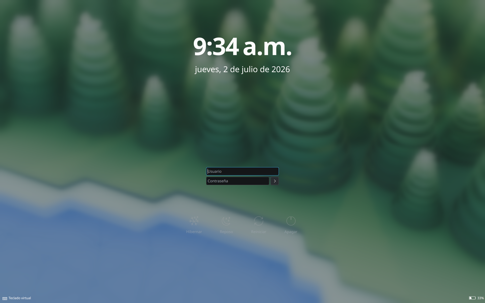
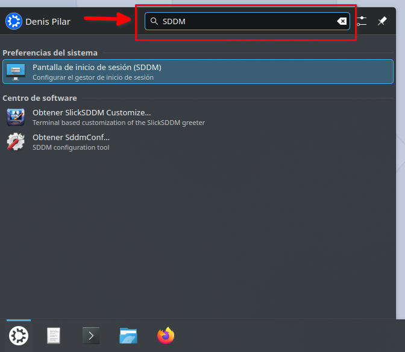
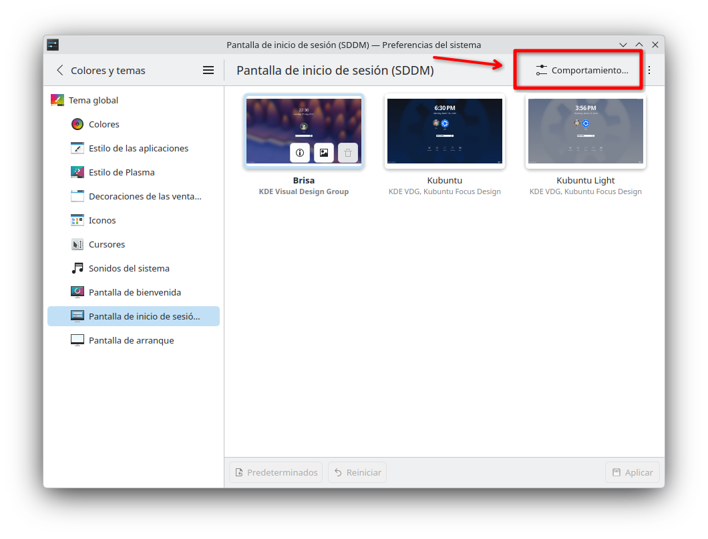
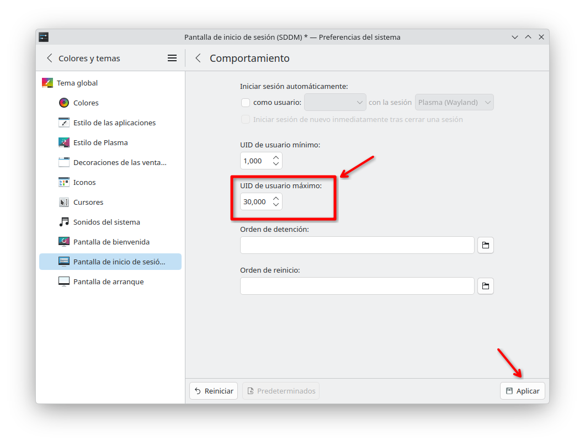
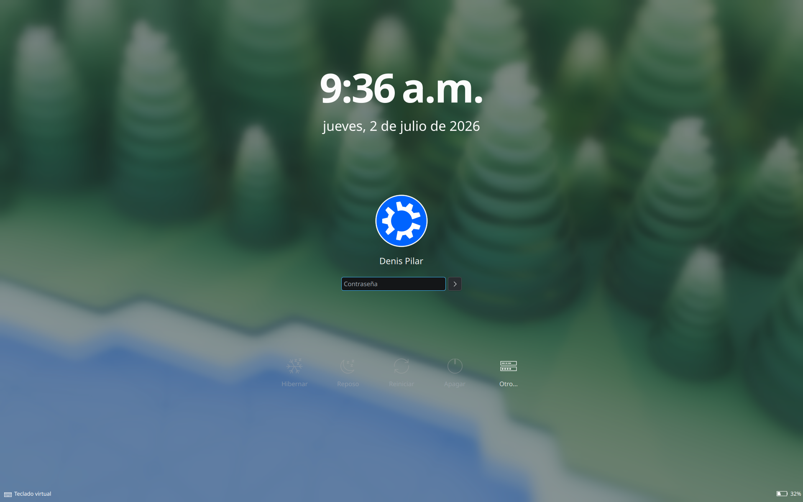

# Flake para sistemas que no son NixOS

Este es un Flake que utiliza Home Manager para instalar paquetes de nix en sistemas que no son NixOS. La intención es traer poder intenalar programas de forma declarativa y reproducible, utilizando un gestor de paquetes independdiente al del sistema. Con esta combinación, se combina lo mejor de una distribución FHS con la declaratividad de paqutes de NixOS.

Quiero destacar que esto no es lo mismo que NixOS, debido a que la configuración del sistema y usuario se siguen realizando de forma imperativa y no es reproducible. Al igual, este flake tampoco instala tipografías.

## Instalación

### Instalar Nix

Para este propósito hay que usar el [instalador de Determinate Systems](https://determinate.systems/blog/determinate-nix-installer/), el cual ya trae activados los flakes.

```bash
curl --proto '=https' --tlsv1.2 -sSf -L https://install.determinate.systems/nix | sh -s -- install
```

Luego hay que verificar la instalación con `nix --version`.

**NOTA:** Es posbible que SDDM deje de mostrar la entrada de tu usuario y la sustituya por dos cuadros de texto que son usuario y contraseña. Más abajo hay un [Fix para que vuelva a mostrar la lista de avatares](#fix-de-sddm).

### Clonar el repositorio

``` bash
git clone https://github.com/Nekoffeedrinker/denisNixKubuntu.git ~/denisNixNoOS/
```

### Activar la configuración

```bash
nix run home-manager/master -- switch --flake ~/denisNixNoOS#denis
```

## Usar Fish

Por defecto no podrás configurar como predeterminadas las shells que no esten en `/etc/shells`. Por eso, hay que agregar la ruta donde se instala fish a esta lista:

```bash
echo "/home/denis/.nix-profile/bin/fish" | sudo tee -a /etc/shells
```

Después de eso ya podrás definir fish como tu predeterminada con:

```bash
chsh -s $(which fish)
```


## Fix de SDDM

### Diagnóstico

El instalador multiusuario de Nix crea varias cuentas con nombres entre `nixbld1` y `nixbld32`, las cuales usa para compilaciones en sandbox (construir paquetes desde codigo fuente de manera aislada). Estas cuentas suelen quedar en un rango de UID que SDDM considera como "usuarios reales", lo cual termina desbordando la lista de avatares que muestra el login manager. 

En otras palabras, SDDM ve muchos usuarios y solo puede mostrar unos pocos, por lo que cambia a una interfaz en la que ahora debes poner el nombre de usuario y contraseña.

<center></center>

En mi instalación descubrí que estas cuentas tienen un UID desde el 30,0001 al 30,032. Para comprobarlo puedes correr:

```bash
grep nixbld /etc/passwd
```

Con ello, la solución es evitar que SDDM las considere, reduciendo el **“UID de usuario máximo”** en la configuración del sistema.

### Solución

Primero hay que buscar la configuración de SDDM. Esto se puede hacer escribiendo la búsuqeda en el lanzador de aplicaciones.

<center></center>

Luego, en la ventana de condiguración hay que buscar el botón **"Comportamiento"** y le damos clic para entrar.

<center></center>

Y finalmente, en este menú modificamos la opción **"UID de usuarios máximo"** para que sea 30,000 (poniendo el límite antes que los usuarios `nixbld`), y le damos a aplicar.

<center></center>

Ahora lo siguiente es reiniciar la computadora y ver que SDDM volvió a mostrar el avatar.

<center></center>

**Nota:** Es posible que los nombres de las opciones no coincidan con los los de tu idioma. Por favor revisa las capturas para entender mejor el proceso.